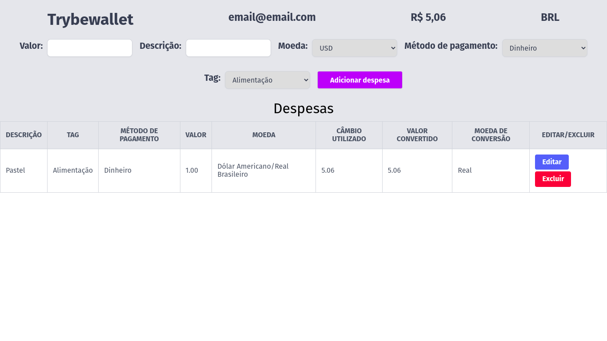

# Welcome to the TrybeWallet project repository!

> This project was developed during the Trybe Software Development course. TrybeWallet is an expense control wallet, where you can add, edit and remove an expense, in addition to viewing a table with registered expenses.

---

- Developed by: [Lucas Ximenes](https://www.linkedin.com/in/lucasdximenes)
- Demo: [TrybeWallet](https://trybewallet-mocha.vercel.app/)

---

## Skills

The following skills were developed in this project:

- Create a Redux store in React applications;

- Create reducers in Redux in React applications;

- Create actions in Redux in React applications;

- Create dispatchers in Redux in React applications;

- Connect Redux to React components;

- Create asynchronous actions in your React application that makes use of Redux.

- Develop tests with react testing library;

- Develop tests in React-Redux;

- Develop tests in React-Router;

---

## What was developed

An expense control application, where you can add, edit and remove an expense, in addition to viewing a table with registered expenses.

---

### Requirements proposed by Trybe:

- [x] 1. Create a login home page with the following fields and characteristics:

  - [x] 1.1. The route to this page must be `/` ;
  - [x] 1.2. There must be a form with the following fields:
    - [x] 1.2.1. An email field;
    - [x] 1.2.2. A password field;
    - [x] 1.2.3. An enter button;
  - [x] 1.3. Required validations:
    - [x] 1.3.1. The login button must be disabled if email or password is empty or wrong;
    - [x] 1.3.2. There must be a validation for the email in the format `email@email.com`;
    - [x] 1.3.3. There must be a validation for the password with at least 6 characters;

- [x] 2. Create a page for your portfolio with the following characteristics:

  - [x] 2.1. The route to this page must be `/wallet` ;
  - [x] 2.2. Create a header for the wallet page containing the following characteristics:
    - [x] 2.2.1. An element that displays the email of the user who has logged in;
    - [x] 2.2.2. an element with the total expense generated by the expense list;
    - [x] 2.2.3. An element that shows the currency used - BRL by default;

- [x] 3. Create a form to add an expense containing the following characteristics:

  - [x] 3.1. It must have a field to add the expense amount;
  - [x] 3.2. It must have a field to add a description for the expense;
  - [x] 3.3. It must have a field to select the expense currency;
  - [x] 3.4. It must have a field to select the payment method;
  - [x] 3.5. It must have a field to select the expense category;
  - [x] 3.6. It must have a button to add the expense;

- [x] 4. Save expenses in the application's global state

  - [x] 4.1. Expenses values ​​must be saved in the application's global state, inside an array in the `expenses` field.
  - [x] 4.2, After adding an expense:
    - [x] 4.2.1. The form must be clean;
    - [x] 4.2.2. The total amount of the expense must be updated in the header;

- [x] 5. Develop tests to achieve 60% full application coverage.

- [x] 6. Develop a table with expenses containing the following characteristics:

  - [x] 6.1. Description;
  - [x] 6.2. Tag;
  - [x] 6.3. Payment method;
  - [x] 6.4. Value;
  - [x] 6.5. Coin;
  - [x] 6.6. Exchange used;
  - [x] 6.7. Converted value;
  - [x] 6.8. Conversion currency;
  - [x] 6.9. Edit / Delete;

- [x] 7. Implement the logic so that the table is fed by the application state:

  - [x] 7.1. The table must be fed by the global state of the application, which will be available in the `expenses` key that comes from the `wallet` reducer.

- [x] 8. Create a button to delete an expense from the table containing the following characteristics:

  - [x] 8.1. Must have the text `Delete`;
  - [x] 8.2. When clicked, it should exclude an expense from the global state.
  - [x] 8.3. When clicked, it should update the total expense in the header.
  - [x] 8.4. When clicked, it should update the table.

- [x] 9. Create a button to edit a table expense containing the following characteristics:

  - [x] 9.1. It must have the text `Edit`;
  - [x] 9.2. When clicked, it must edit an expense of the global state.
  - [x] 9.3. The add expense form must be filled in with the information for the expense you wish to edit.
  - [x] 9.4. The form should have an `Edit Expense` button instead of `Add Expense` and, when clicked, should update the expense in the global state.
  - [x] 9.5. When being updated, it must update the total expense in the header.
  - [x] 9.6. When being updated, it must update the table.

- [x] 10. Develop tests to achieve 90% full application coverage.
