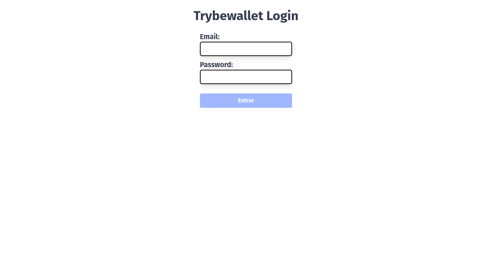
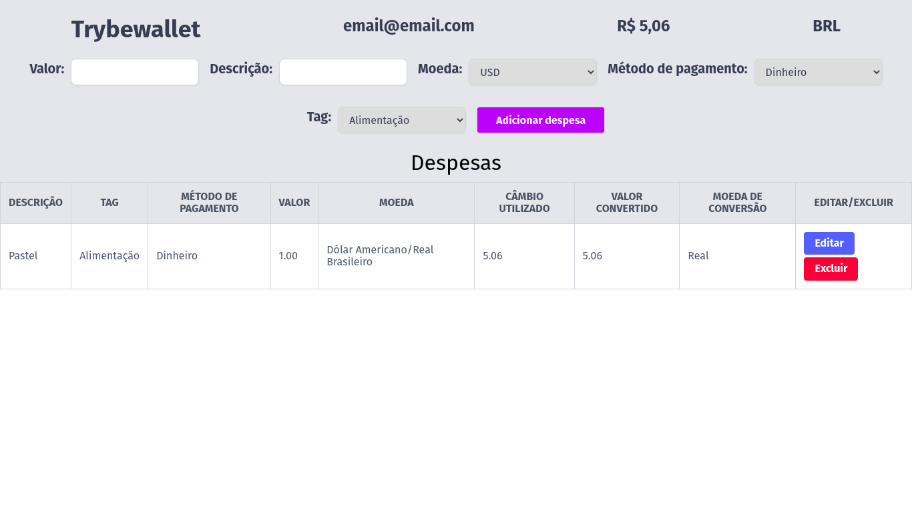

# Boas-vindas ao repositório do projeto TrybeWallet!

> Este projeto foi desenvolvido durante o curso de Desenvolvimento de Software da Trybe. O TrybeWallet é uma carteira de controle de gastos, onde é possível adicionar, editar e remover uma despesa, além de visualizar uma tabela com as despesas cadastradas.

---

- Desenvolvido por: [Lucas Ximenes](https://www.linkedin.com/in/lucasdximenes)
- Demostração: [TrybeWallet](https://trybewallet-mocha.vercel.app/)

---

## Habilidades

Neste projeto foi desenvolvido as seguintes habilidades:

- Criar um store Redux em aplicações React;

- Criar reducers no Redux em aplicações React;

- Criar actions no Redux em aplicações React;

- Criar dispatchers no Redux em aplicações React;

- Conectar Redux aos componentes React;

- Criar actions assíncronas na sua aplicação React que faz uso de Redux.

- Desenvolver testes com react testing library;

- Desenvolver testes em React-Redux;

- Desenvolver testes em React-Router;

---

## O que foi desenvolvido

Uma aplicação de controle de gastos, onde é possível adicionar, editar e remover uma despesa, além de visualizar uma tabela com as despesas cadastradas.

---

### Requisitos propostos pela Trybe:

- [x] 1. Crie uma página inicial de login com os seguintes campos e características:

  - [x] 1.1. A rota para esta página deve ser `/` ;
  - [x] 1.2. Deve existir um formulário com os seguintes campos:
    - [x] 1.2.1. Um campo de email;
    - [x] 1.2.2. Um campo de senha;
    - [x] 1.2.3. Um botão de entrar;
  - [x] 1.3. Validações necessárias:
    - [x] 1.3.1. O botão de entrar deve estar desabilitado caso email ou senha estejam vazios ou errados;
    - [x] 1.3.2. Deve haver uma validação para o email no formato `email@email.com`;
    - [x] 1.3.3. Deve haver uma validação para a senha com no mínimo 6 caracteres;

- [x] 2. Crie uma página para sua carteira com as seguintes características:

  - [x] 2.1. A rota para esta página deve ser `/carteira` ;
  - [x] 2.2. Crie um header para a página de carteira contendo as seguintes características:
    - [x] 2.2.1. Um elemento que exiba o email da pessoa usuária que fez login;
    - [x] 2.2.2. um elemento com a despesa total gerada pela lista de gastos;
    - [x] 2.2.3. Um elemento que mostre qual a moeda corrente utilizada - BRL por padrão;

- [x] 3. Crie um formulário para adicionar uma despesa contendo as seguintes características:

  - [x] 3.1. Deve possuir um campo para adicionar o valor da despesa;
  - [x] 3.2. Deve possuir um campo para adicionar uma descrição para a despesa;
  - [x] 3.3. Deve possuir um campo para selecionar a moeda da despesa;
  - [x] 3.4. Deve possuir um campo para selecionar o método de pagamento;
  - [x] 3.5. Deve possuir um campo para selecionar a categoria da despesa;
  - [x] 3.6. Deve possuir um botão para adicionar a despesa;

- [x] 4. Salve as despesas no estado global da aplicação

  - [x] 4.1. Os valores das despesas devem ser salvos no estado global da aplicação, dentro de um array no campo `expenses`.
  - [x] 4.2, Após adicionar uma despesa:
    - [x] 4.2.1. O formulário deve ser limpo;
    - [x] 4.2.2. O valor total da despesa deve ser atualizado no header;

- [x] 5. Desenvolva testes para atingir 60% de cobertura total da aplicação.

- [x] 6. Desenvolva uma tabela com os gastos contendo as seguintes características:

  - [x] 6.1. Descricao;
  - [x] 6.2. Tag;
  - [x] 6.3. Método de pagamento;
  - [x] 6.4. Valor;
  - [x] 6.5. Moeda;
  - [x] 6.6. Câmbio utilizado;
  - [x] 6.7. Valor convertido;
  - [x] 6.8. Moeda de conversão;
  - [x] 6.9. Editar / Excluir;

- [x] 7. Implemente a lógica para que a tabela seja alimentada pelo estado da aplicação:

  - [x] 7.1. A tabela deve ser alimentada pelo estado global da aplicação, que estarão disponíveis na chave `expenses` que vem do reducer `wallet`.

- [x] 8. Crie um botão para deletar uma despesa da tabela contendo as seguintes características:

  - [x] 8.1. Deve possuir o texto `Excluir`;
  - [x] 8.2. Ao ser clicado, deve excluir uma despesa do estado global.
  - [x] 8.3. Ao ser clicado, deve atualizar a despesa total no header.
  - [x] 8.4. Ao ser clicado, deve atualizar a tabela.

- [x] 9. Crie um botão para editar uma despesa da tabela contendo as seguintes características:

  - [x] 9.1. Deve possuir o texto `Editar`;
  - [x] 9.2. Ao ser clicado, deve editar uma despesa do estado global.
  - [x] 9.3. O formulário de adicionar despesa deve ser preenchido com as informações da despesa que se deseja editar.
  - [x] 9.4. O formulário deve ter um botão de `Editar despesa` ao invés de `Adicionar despesa` e, ao ser clicado, deve atualizar a despesa no estado global.
  - [x] 9.5. Ao ser atualizado, deve atualizar a despesa total no header.
  - [x] 9.6. Ao ser atualizado, deve atualizar a tabela.

- [x] 10. Desenvolva testes para atingir 90% de cobertura total da aplicação.
